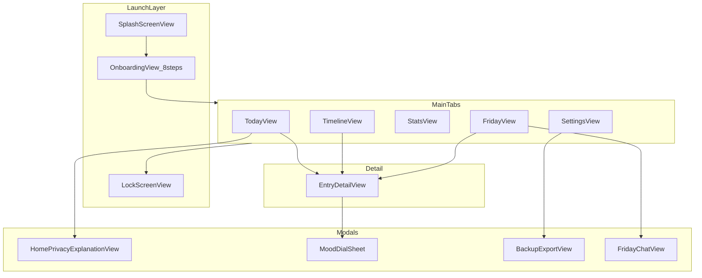
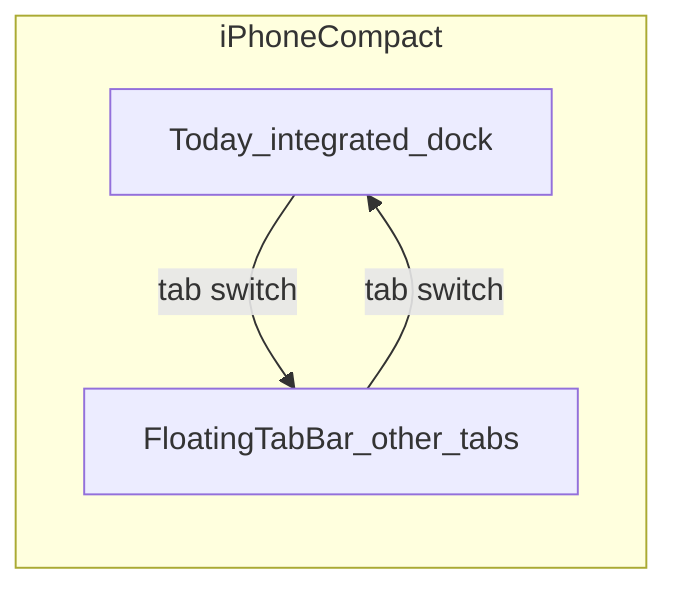

# OffRecord Deep UI Audit

## Anti-Patterns Verdict: **Pass (with caveats)**

OffRecord does **not** read as generic AI slop. The warm cream palette, daypart hero art, Friday mascot, mood artwork, and privacy-forward copy are distinctive and aligned with the product promise. The main risks are **internal inconsistency** (not aesthetic failure): duplicated empty states, mixed layout padding, a non-functional Dark theme, and Insights density creeping toward “analytics dashboard” territory the design spec explicitly warns against.

---

## Executive Summary

| Severity | Count | Top themes                                                              |
| -------- | ----- | ----------------------------------------------------------------------- |
| Critical | 3     | Broken Dark theme, uneven accessibility, Insights overload              |
| High     | 8     | Spacing drift, empty-state fragmentation, tab UX split, error surfacing |
| Medium   | 12    | Card styling duplication, Settings visual break, iPad under-use         |
| Low      | 10    | Polish, copy, micro-interactions, widget parity                         |

**Overall quality:** ~7.5/10 — premium Today hero and Friday companion experience; systemic gaps in consistency and adaptive design.

**Recommended next steps (priority order):**

1. Fix theme system + consolidate empty/loading/error components
2. Restructure Insights information hierarchy
3. Normalize screen padding and card modifiers app-wide
4. Accessibility pass on secondary screens
5. iPad two-column layouts for Insights, Friday, Settings

---

## App Map (all audited surfaces)

---

## Screen-by-Screen Findings

### 1. Splash — [SplashScreenView.swift](OffRecord/SplashScreenView.swift)

**Strengths**

- Respects `accessibilityReduceMotion` with shortened path
- Uses brand gradient + app icon asset consistently

**Gaps**

| Severity | Issue                                               | Recommendation                                   |
| -------- | --------------------------------------------------- | ------------------------------------------------ |
| Low      | No accessibility announcement that app is loading   | Add `.accessibilityLabel("OffRecord")` on icon   |
| Low      | Icon scale animation may feel abrupt on large iPads | Cap max scale; consider subtle fade-only on iPad |

---

### 2. Onboarding — [OnboardingView.swift](OffRecord/OnboardingView.swift), [ConcentricPageTransitionView.swift](OffRecord/ConcentricPageTransitionView.swift)

**Strengths**

- 8-step questionnaire matches high-converting onboarding patterns (intent → privacy → lock → first entry)
- Concentric transitions are memorable and reduce-motion aware
- Speech consent and notification-denied flows handled with calm copy

**Gaps**

| Severity | Issue                                                                       | Recommendation                                                                                                            |
| -------- | --------------------------------------------------------------------------- | ------------------------------------------------------------------------------------------------------------------------- |
| High     | **2,300+ line monolith** — hard to maintain visual consistency across steps | Extract step views into feature folder; shared step header/footer components                                              |
| Medium   | Progress not visible (users can't tell 3/8 vs 7/8)                          | Add subtle step indicator or progress ring (design spec allows chips, not dots spam)                                      |
| Medium   | Name field uses UIKit bridge — keyboard lift logic is complex               | Verify Dynamic Type at AX sizes; add visible focus state                                                                  |
| Medium   | First-entry transcription loading is generic `ProgressView`                 | Reuse `HeroRecordingMeter` visual language for continuity with Today                                                      |
| Low      | CTA copy varies per step but pill styling is ad hoc                         | Wire up unused `offRecordPillButton()` modifier from [OffRecordDesignTokens.swift](OffRecord/OffRecordDesignTokens.swift) |

---

### 3. Lock Screen — [LockScreenView.swift](OffRecord/LockScreenView.swift)

**Strengths**

- Sage trust color, clear biometry CTA, inline failure message (not alert spam)
- Card-on-gradient matches app tone

**Gaps**

| Severity | Issue                                                                         | Recommendation                                                     |
| -------- | ----------------------------------------------------------------------------- | ------------------------------------------------------------------ |
| High     | Unlock button lacks `accessibilityLabel` / hint                               | Label as "Unlock with Face ID" + hint "Double tap to authenticate" |
| Medium   | Auto-prompt on appear can confuse VoiceOver users (system sheet + view sheet) | Delay auto-auth until after VoiceOver finish announcement          |
| Medium   | No passcode fallback affordance when biometry fails repeatedly                | Surface "Try Again" vs system passcode per HIG                     |
| Low      | Title says "OffRecord AI Journal is Locked" — long for small phones           | Shorten to "Journal locked" with subtitle for product name         |

---

### 4. Today (Home) — [TodayView.swift](OffRecord/TodayView.swift), [TodayFullBleedHeroView.swift](OffRecord/TodayFullBleedHeroView.swift), [DaypartHeroCards.swift](OffRecord/TodayFullBleedHeroView.swift)

**Strengths**

- **Best screen in the app.** Full-bleed daypart hero, readability gradients, `@ScaledMetric` typography, recording state machine, integrated bottom dock
- Privacy chip + sheet ([HomePrivacyExplanationView.swift](OffRecord/HomePrivacyExplanationView.swift)) reinforce trust
- Hero recording meter, haptics, and CTA color states (plum → coral when recording) are excellent

**Gaps**

| Severity | Issue                                                                                                                                                          | Recommendation                                                               |
| -------- | -------------------------------------------------------------------------------------------------------------------------------------------------------------- | ---------------------------------------------------------------------------- |
| High     | **Tab bar split:** Today uses integrated dock; other tabs use [OffRecordFloatingTabBar](OffRecord/ContentView.swift) — users lose muscle memory switching tabs | Consider persistent mini-tab strip above dock, or unify chrome               |
| Medium   | Hero text on night backgrounds — gradient overlay helps but verify WCAG on all 12 hero assets                                                                  | Audit contrast per asset; bump night overlay opacity if needed               |
| Medium   | `WelcomeCard` vs daypart hero — two first-run visual languages                                                                                                 | Consolidate: hero-only for returning users, WelcomeCard only when no history |
| Medium   | Prompt chips (`PromptChip`) lack accessibility labels                                                                                                          | Add labels: "Prompt: {text}, double tap to select"                           |
| Low      | Compact dock record button (92pt) exceeds 44pt minimum — good — but side actions (60pt) are borderline                                                         | Ensure 44pt hit targets including glass padding                              |
| Low      | Privacy sheet uses `.medium` detent — content fits; add `.large` fallback for AX text sizes                                                                    | Use `presentationDetents` with size-class branching                          |

---

### 5. Timeline — [TimelineView.swift](OffRecord/TimelineView.swift), [TimelineEntryCard.swift](OffRecord/TimelineEntryCard.swift)

**Strengths**

- Archive metaphor works: month sections, date spine, mood artwork, semantic search banner
- Good reduce-motion on planter easter egg; filter chips use readable tint styles
- Centered column (`maxContentWidth: 860`) matches design spec

**Gaps**

| Severity     | Issue                                                                                                                                                              | Recommendation                                                                  |
| ------------ | ------------------------------------------------------------------------------------------------------------------------------------------------------------------ | ------------------------------------------------------------------------------- |
| **Critical** | **Horizontal padding is 8px** ([TimelineView.swift L120](OffRecord/TimelineView.swift)) vs **24px spec** in [OffRecord Design.md](OffRecord/OffRecord%20Design.md) | Change to `OffRecordSpacing.screenX` (24) or `TimelineDesign.contentInset` (20) |
| High         | Custom empty search state instead of [EmptyStateView.noSearchResults](OffRecord/EmptyStateView.swift)                                                              | Adopt shared component; add CTA "Clear filters"                                 |
| High         | `VoiceSearchManager.errorMessage` not surfaced in UI                                                                                                               | Inline banner below search field with retry                                     |
| Medium       | Search uses UIKit `UISearchBar` bridge — styling may diverge from native SwiftUI on iOS 26                                                                         | Evaluate `.searchable` with design-token styling                                |
| Medium       | Edit-mode delete is destructive but no undo/snackbar                                                                                                               | Add brief "Entry deleted · Undo" toast                                          |
| Low          | Planter decoration has no accessibility label (correctly non-essential) but no hint it is interactive                                                              | `accessibilityHint("Decorative, shakes when tapped")` optional                  |

---

### 6. Insights — [StatsView.swift](OffRecord/StatsView.swift), streak/shareable cards

**Strengths**

- Streak card ([StreakCardView.swift](OffRecord/StreakCardView.swift)) uses `ViewThatFits` + `@ScaledMetric` — model adaptive component
- Charts use soft aqua/mint palette; milestone overlay adds delight
- Shareable insight cards are on-brand

**Gaps**

| Severity     | Issue                                                                                                                                                                                                                                                            | Recommendation                                                                                                                 |
| ------------ | ---------------------------------------------------------------------------------------------------------------------------------------------------------------------------------------------------------------------------------------------------------------- | ------------------------------------------------------------------------------------------------------------------------------ |
| **Critical** | **Card overload:** when data exists, screen stacks ~9 sections (Weekly Insights, Proactive Reflection, AI Insights, Streak, Goal, Week Activity, Mood Trends, Writing Stats, Weekly Reflection) — violates design spec: *"Do not overcrowd the Insights screen"* | Restructure into 3 tiers: **Hero** (streak + goal), **This week** (activity + mood), **Deeper** (collapsible or "See all" hub) |
| High         | Duplicate reflection content: `ProactiveWeeklyReflectionCard` + `weeklySummaryCard` + `WeeklyInsightsSection` overlap semantically                                                                                                                               | Merge into one weekly story card                                                                                               |
| High         | Empty state hand-rolled ([StatsView L93-117](OffRecord/StatsView.swift)) vs unused `EmptyStateView.noInsights`                                                                                                                                                   | Use shared preset + CTA linking to Today tab                                                                                   |
| Medium       | Week activity dots are 32pt on iPhone — below 44pt touch target (display-only, OK) but cramped at AX5                                                                                                                                                            | Increase spacing or switch to horizontal scroll                                                                                |
| Medium       | Mood chart Y-axis uses 14pt mood icons — may fail contrast at small sizes                                                                                                                                                                                        | Use readable foreground colors only                                                                                            |
| Medium       | No section headers / visual rhythm between similar tinted cards (mint, lavender, warm repeat)                                                                                                                                                                    | Alternate surface-primary vs tinted; add section labels                                                                        |
| Low          | Milestone overlay lacks dismiss button — tap-outside only                                                                                                                                                                                                        | Add explicit "Continue" pill button                                                                                            |

---

### 7. Friday — [FridayView.swift](OffRecord/FridayView.swift), [FridayChatView.swift](OffRecord/FridayChatView.swift)

**Strengths**

- Mascot + radial glow + "Talk to Friday" CTA deliver companion feel
- Section picker (Overview / Personality / Emotions / My World / Patterns) maps to design spec
- Chat has strong accessibility identifiers; evidence chips link to entries

**Gaps**

| Severity | Issue                                                                               | Recommendation                                                                      |
| -------- | ----------------------------------------------------------------------------------- | ----------------------------------------------------------------------------------- |
| High     | **5 horizontal tabs + long scroll** = high cognitive load; Patterns buried last     | Default to Overview; move Patterns into chat suggestions                            |
| Medium   | Header stack is tall (200pt glow + 132pt mascot) before actionable CTA on iPhone SE | Collapse mascot on scroll (`scrollTransition` / pinned header)                      |
| Medium   | Insight cards reuse similar lavender tint — hard to scan                            | Vary semantic tints per card type (personality=lavender, emotions=blush, world=sky) |
| Medium   | Empty state when `<5 data points` is easy to miss at bottom of Overview             | Pin maturity progress + empty CTA near "Talk to Friday"                             |
| Medium   | Section picker tabs lack `accessibilityAddTraits(.isSelected)`                      | Add for VoiceOver                                                                   |
| Low      | "Friday" title + navigation title duplicate                                         | Use inline title or hide nav title on scroll                                        |

**Friday Chat specific**

| Severity | Issue                                                                                  | Recommendation                         |
| -------- | -------------------------------------------------------------------------------------- | -------------------------------------- |
| Medium   | Suggested questions grid is long (10 items) — choice paralysis                         | Show 4 contextual suggestions + "More" |
| Low      | User/assistant bubble contrast relies on tint fills — verify in Increase Contrast mode | Test with iOS accessibility settings   |

---

### 8. Entry Detail — [EntryDetailView.swift](OffRecord/EntryDetailView.swift), [MoodDialView.swift](OffRecord/MoodDialView.swift), [AudioPlayerView.swift](OffRecord/AudioPlayerView.swift)

**Strengths**

- Mood dial is a standout interaction ([MoodDialWheel.swift](OffRecord/MoodDialWheel.swift) — full VoiceOver semantics)
- Clean read/edit toggle; star + mood in header
- Audio player uses glass controls consistently

**Gaps**

| Severity | Issue                                                                                              | Recommendation                                          |
| -------- | -------------------------------------------------------------------------------------------------- | ------------------------------------------------------- |
| Medium   | Edit mode is plain `TextEditor` — no toolbar formatting, date change, or prompt context visibility | Show prompt context chip if entry came from hero/Friday |
| Medium   | AI insights section appears only in read mode below fold — easy to miss                            | Collapsible card at top with sage/lavender tint         |
| Medium   | Photo section + audio + text + AI = long scroll without sticky actions                             | Sticky bottom bar: Mood · Star · Share                  |
| Low      | "Edit"/"Done" text button competes with star icon — inconsistent affordance                        | Use pencil icon with label for edit                     |
| Low      | Audio error is coral inline text only ([AudioPlayerView.swift](OffRecord/AudioPlayerView.swift))   | Reuse warning tint style from tokens                    |

---

### 9. Settings — [SettingsView.swift](OffRecord/SettingsView.swift), [BackupExportView.swift](OffRecord/BackupExportView.swift)

**Strengths**

- Comprehensive: export, themes, lock, semantic memory, iCloud, storage
- Destructive actions use confirmation alerts with clear copy
- Theme swatches ([ThemeButton](OffRecord/SettingsView.swift)) use glass selection ring

**Gaps**

| Severity     | Issue                                                                                                                                             | Recommendation                                                                    |
| ------------ | ------------------------------------------------------------------------------------------------------------------------------------------------- | --------------------------------------------------------------------------------- |
| **Critical** | **Dark theme is broken:** [ThemeManager.swift L38-40](OffRecord/ThemeManager.swift) forces `colorScheme: .light` for all themes including `.dark` | Implement true dark surfaces using existing `darkBackground`/`darkSurface` tokens |
| High         | **Form-based layout** breaks from card-based design elsewhere — feels like system Settings, not OffRecord                                         | Migrate to grouped `offRecordContentCard` sections matching design spec           |
| High         | Theme picker shows 8 themes but only changes accent — backgrounds stay cream                                                                      | Either rename to "Accent color" or implement full theme surfaces                  |
| Medium       | Export section is dense — year/month/paper size/starred toggles without progressive disclosure                                                    | Wizard-style export sheet                                                         |
| Medium       | Storage rows lack visual hierarchy (audio vs photos vs DB)                                                                                        | Horizontal bar chart or proportional rows                                         |
| Low          | About section product name "OffRecord AI Journal" vs user-facing "OffRecord" elsewhere                                                            | Unify naming                                                                      |

---

### 10. Widgets — [OffRecordWidget.swift](OffRecordWidget/OffRecordWidget.swift)

**Gaps**

| Severity | Issue                                                                                                                        | Recommendation                                         |
| -------- | ---------------------------------------------------------------------------------------------------------------------------- | ------------------------------------------------------ |
| Medium   | Duplicated tokens in [OffRecordWidget/OffRecordDesignTokens.swift](OffRecordWidget/OffRecordDesignTokens.swift) — drift risk | Shared SPM design-tokens target                        |
| Medium   | Widget variants (streak, mood, quick record) not visually audited against app hero/streak art                                | Use `StreakFire` asset + readable text colors from app |
| Low      | No widget configuration UI preview in app Settings                                                                           | Link to widget gallery from Settings                   |

---

## Cross-Cutting System Issues

### Design System Consistency

| Issue                                                                               | Location                                                                      | Fix                                                                |
| ----------------------------------------------------------------------------------- | ----------------------------------------------------------------------------- | ------------------------------------------------------------------ |
| `offRecordPillButton()` defined but **never used**                                  | [OffRecordDesignTokens.swift L288-317](OffRecord/OffRecordDesignTokens.swift) | Adopt for all primary CTAs                                         |
| `EmptyStateView` presets **dead code**                                              | Timeline, Stats, Friday hand-roll empties                                     | Single source of truth                                             |
| Card styling split: `offRecordCard` vs `offRecordContentCard` vs inline RoundedRect | TimelineEntryCard, MonthSummaryCard, Stats cards                              | One card modifier with semantic fill param                         |
| Padding inconsistency: 8 / 16 / 20 / 24 mixed                                       | Multiple views                                                                | Enforce `OffRecordSpacing.screenX` (24) on all root scroll content |

### Navigation & Chrome

- **Today dock vs floating tab bar** is the biggest navigation UX inconsistency ([ContentView.swift L62-67](OffRecord/ContentView.swift))
- Tab icons differ between compact (`book.pages.fill`) and regular TabView (`list.bullet`) — minor but noticeable on iPad

### Accessibility (A11y) Scorecard

| Area                 | Status    | Notes                                                          |
| -------------------- | --------- | -------------------------------------------------------------- |
| Mood Dial            | Excellent | Full label/value/hint                                          |
| Proactive Reflection | Excellent | Systematic identifiers                                         |
| Friday Chat          | Good      | Message + chip labels                                          |
| Today Hero           | Good      | Identifiers on key elements                                    |
| Timeline             | Partial   | Entry cards good; filters weak                                 |
| Insights             | Poor      | ~1 a11y reference in StatsView                                 |
| Settings             | Partial   | Some identifiers                                               |
| Empty states         | Poor      | No labels on preset components                                 |
| Dynamic Type         | Partial   | StreakCard + Hero use `@ScaledMetric`; most cards don't branch |

**WCAG risks to test on device:**

- Pastel text on pastel fills (especially `textSecondary` on mint/lavender cards)
- 32pt week-activity circles at AX5
- Glass controls with reduce transparency fallback (handled in [OffRecordLiquidGlass.swift](OffRecord/OffRecordLiquidGlass.swift) — verify visually)

### Motion & Haptics

**Strengths:** Reduce motion honored in Splash, onboarding, mascot, mood dial, timeline planter.

**Gaps:**

- No global `@Environment(\.accessibilityReduceMotion)` policy document
- Stats goal ring animates even when reduce motion on — should respect setting
- Filter chip remove uses spring — minor

### Copy & Voice (vs design spec)

**On-brand examples found:** "Ask Friday what she noticed", privacy reassurance, non-judgmental Friday insights.

**Improve:**

- Milestone copy ("Your dedication to self-reflection is paying off") edges toward therapy-speak — spec says avoid
- Settings alerts say "OffRecord AI Journal" — inconsistent product name
- Insights empty: "Insights will appear here" is passive — prefer "Record a few entries to see your streak"

---

## iPad / Responsive Gaps

Design spec calls for two-column layouts on Insights, Settings, Friday. Current state:

| Screen       | iPad behavior                   | Gap                                                      |
| ------------ | ------------------------------- | -------------------------------------------------------- |
| Today        | `maxWidth: 700`, larger buttons | Good single column; no side-by-side hero + entry preview |
| Timeline     | `maxWidth: 860` centered        | Good                                                     |
| Insights     | `maxWidth: 700` single column   | **Missing 2-column bento grid**                          |
| Friday       | `maxWidth: 700` single column   | **Missing 2-column** (mascot left, cards right)          |
| Settings     | Full-width Form                 | **Should use split layout**                              |
| Entry Detail | `maxWidth: 700`                 | Acceptable; could use readable margin on very wide       |

---

## Prioritized Improvement Roadmap

### Phase 1 — Trust & correctness (1-2 days)

- Fix Dark theme (`ThemeManager.colorScheme` + dark surface tokens)
- Rename theme picker to "Accent" OR implement full dark surfaces
- Timeline horizontal padding → 24px
- Surface voice search errors in Timeline

### Phase 2 — Consistency (2-3 days)

- Wire `EmptyStateView` presets into Timeline, Stats, Friday
- Adopt `offRecordPillButton()` for primary CTAs
- Consolidate card modifier usage
- Lock screen + empty state accessibility labels

### Phase 3 — Information architecture (3-5 days)

- Restructure Insights into tiered hierarchy (reduce 9 cards → 3-4 visible sections)
- Merge duplicate weekly reflection surfaces
- Friday: collapse header on scroll; reduce section tabs cognitive load

### Phase 4 — Platform polish (3-5 days)

- Unified tab chrome (dock + tab bar strategy)
- Settings card-based redesign
- iPad two-column layouts
- Shared design tokens package for widgets

### Phase 5 — Delight (ongoing)

- Milestone copy refinement
- Entry detail sticky actions
- Skeleton loading for semantic memory index
- Widget visual parity with streak fire artwork

---

## Files Most Impacted by Remediation

| Priority | Files                                                                                                                                                                          |
| -------- | ------------------------------------------------------------------------------------------------------------------------------------------------------------------------------ |
| P0       | [ThemeManager.swift](OffRecord/ThemeManager.swift), [TimelineView.swift](OffRecord/TimelineView.swift), [StatsView.swift](OffRecord/StatsView.swift)                           |
| P1       | [EmptyStateView.swift](OffRecord/EmptyStateView.swift), [OffRecordDesignTokens.swift](OffRecord/OffRecordDesignTokens.swift), [ContentView.swift](OffRecord/ContentView.swift) |
| P2       | [SettingsView.swift](OffRecord/SettingsView.swift), [FridayView.swift](OffRecord/FridayView.swift), [EntryDetailView.swift](OffRecord/EntryDetailView.swift)                   |
| P3       | [OffRecordWidget/OffRecordWidget.swift](OffRecordWidget/OffRecordWidget.swift), [OnboardingView.swift](OffRecord/OnboardingView.swift)                                         |

---

## What Is Already Working Well (preserve these)

1. **Today full-bleed daypart hero** — premium, emotionally resonant, voice-first
2. **Readable tint system** — separates pastel fills from readable foregrounds ([OffRecordReadableTintStyle](OffRecord/OffRecordDesignTokens.swift))
3. **Liquid Glass with fallbacks** — iOS 26-ready without sacrificing legibility
4. **Mood dial interaction** — best-in-class custom control with accessibility
5. **Privacy UX** — badges, sheets, and copy reinforce on-device promise
6. **Friday companion positioning** — mascot + chat + evidence chips feel cohesive
7. **Haptic vocabulary** — consistent feedback across record/save/delete/selection

