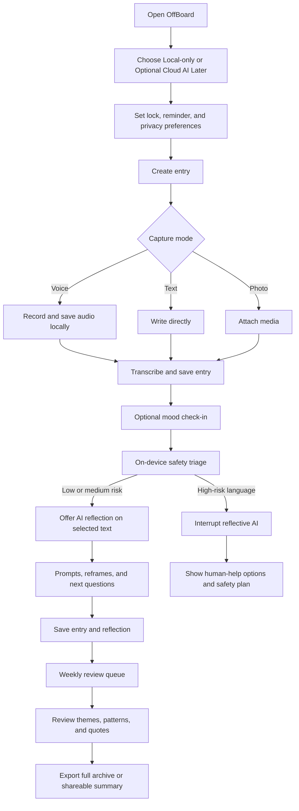
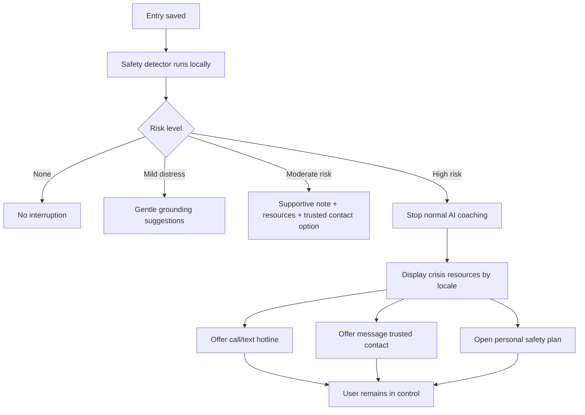
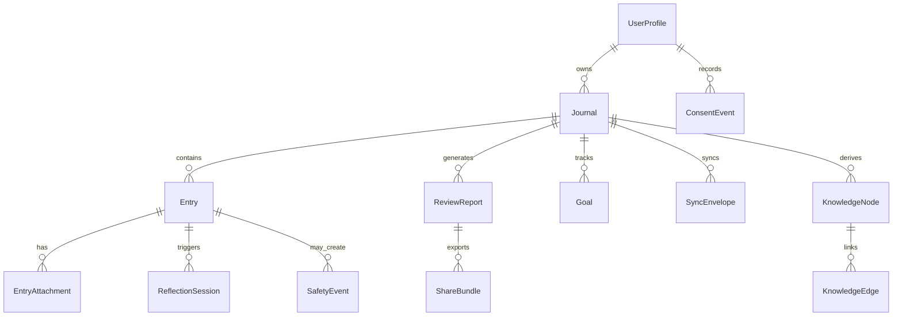

# OffBoard product strategy, roadmap, and PRD

## Executive summary

For this report, I use **OffBoard** as the future product name, while the current public repository and in-app branding are still **OffRecord**. The repo already contains a meaningful iOS-first foundation: a native SwiftUI/Xcode app, widget target, unit/UI tests, Core Data storage, optional CloudKit entitlements, biometric access, export services, and a local “Friday” assistant layer that performs sentiment/entity analysis and generates insights from journal data. The shipped roadmap also shows a clear ambition toward semantic search, Apple Foundation Models, and a more capable private assistant. citeturn45view0turn46view0turn11view0turn17view0turn16view0turn16view1

The market opportunity is real, but the category is split by trade-offs rather than by one clear winner. Day One has the strongest classic-journaling and encryption reputation, but its AI features can involve temporarily decrypting selected content and sending it to an AI service unless an on-device model is used. Rosebud and Reflection lean harder into AI guidance, weekly synthesis, and conversational support, but their public privacy models are less local-first than the posture you want for OffBoard. Daylio wins on speed, mood tracking, and local privacy, but not AI reflection. Apple Journal and Google Journal are powerful free defaults inside their ecosystems, with Apple emphasizing on-device suggestions and Google explicitly stating that Journal is not a substitute for therapy or professional mental health care. citeturn42view1turn42view2turn42view3turn43view0turn43view1turn43view2turn43view3turn44view0turn44view1turn44view3turn24search0turn24search1turn41view3turn25view0

The strongest strategic position for OffBoard is therefore **not** “another journaling app” and **not** “AI therapist.” It should be a **privacy-first, therapist-adjacent reflection companion**: voice-first capture, local-first storage and inference, careful weekly and monthly reflection, and explicit tools for preparing to talk with a real therapist, coach, or trusted person. That framing is also safer. Research on LLM-assisted journaling shows that AI can broaden reflection and help users see experiences from multiple perspectives, but it also warns about authorship loss, over-reliance, and undue trust. Separate mental-health-chatbot research is more cautionary still, especially for at-risk users, and major public guidance in health AI emphasizes careful limits, transparency, and human oversight. citeturn36view0turn36view2turn36view3turn37view0turn35view3turn38view0turn30search2turn29search3turn25view0

The product recommendation is to launch **iOS-first and local-first**, because the repo already fits that path and Apple now provides an on-device foundation-model route that is tightly integrated with Swift and designed for private, offline inference on supported devices. Optional cloud AI should come later, behind explicit consent, narrow prompt scoping, and enterprise-grade retention controls such as OpenAI’s optional Zero Data Retention path or Anthropic’s ZDR/HIPAA-ready offerings where appropriate. citeturn45view0turn46view0turn40view0turn40view1turn39view0turn39view1

The single most important repo-audit finding is a **privacy-copy mismatch**. The README markets voice journaling as fully offline and says nothing is ever transmitted off-device, but the shipped `SpeechTranscriber` implementation says transcription is prioritized on-device and may fall back to Apple’s servers when online for better punctuation. That is fixable, but it means OffBoard’s privacy promise must be made more precise before scale. citeturn45view0turn14view0

## Market landscape and positioning

**Assumptions.** Target geography, budget, and team size were not specified. I therefore assume a small product squad, consumer launch, and mobile-first development. Because the current codebase is a native Apple app with iPhone/iPad support, optional CloudKit sync, and an Apple-framework-heavy AI roadmap, the most efficient path is iOS-first rather than immediate parity across all platforms. citeturn45view0turn46view0turn17view0

The market breaks into four practical segments: **ecosystem journals** that win through distribution, **classic journaling platforms** that win through memory-keeping and exportability, **mood and habit trackers** that win through low friction, and **AI-guided reflection apps** that win through follow-up questions, summaries, and emotional analysis. OffBoard should sit between classic privacy journaling and AI-guided reflection, while pushing harder than competitors on local-first architecture and therapist-prep workflows. citeturn42view1turn42view2turn43view1turn44view1turn24search0turn41view3turn25view0

| Segment | Primary user job | Representative products | Open gap for OffBoard | Sources |
|---|---|---|---|---|
| Ecosystem journals | “Give me a free, default journal tied to my phone and personal context.” | Apple Journal, Google Journal | Stronger privacy controls, better exportability, and richer therapist-prep reflection than default apps offer today. | Official docs citeturn41view3turn25view0 |
| Classic private journals | “Store my life safely, across devices, with durable exports.” | Day One | More local-first AI and clearer processing-mode transparency. | Official docs citeturn42view0turn42view1turn42view2turn42view3 |
| Mood and habit trackers | “Help me check in fast and show patterns.” | Daylio | More narrative depth, voice capture, and guided review without losing low-friction check-ins. | Official docs citeturn24search0turn24search1 |
| AI-guided reflection | “Talk to me, ask follow-ups, and summarize my patterns.” | Rosebud, Reflection | Stronger local-first guarantees, clearer boundaries, and safer therapist-adjacent positioning. | Official docs citeturn43view0turn43view1turn43view2turn43view3turn44view0turn44view1turn44view2turn44view3turn44view4 |

### Competitor feature matrix

| Product | Capture model | AI reflection depth | Reviews and insights | Privacy posture in public docs | Pricing and platforms | OffBoard takeaway | Sources |
|---|---|---|---|---|---|---|---|
| **Day One** | Text, media, audio, Apple Watch dictation, web/browser access | Daily Chat, Go Deeper prompts, entry highlights, summaries, titles, image generation | Multi-entry summaries; strong export and memory-keeping posture | Core journals are E2EE; AI use requires consent and can temporarily bypass E2EE unless an on-device model is used | Basic free; Silver $49.99/year; Gold $74.99/year; iPhone, iPad, Android, Mac, Windows, web, Watch | Benchmark for premium journaling UX and export durability; beat it on default local AI and therapist-prep tools | Official docs citeturn42view0turn42view1turn42view2turn42view3turn42view4turn42view5 |
| **Rosebud** | Text, voice journaling, call mode, custom journals | Ask Rosebud, dig deeper, entry reflection, long-term memory | Weekly report with themes, mood trends, people, and in-depth analysis after 1,500+ words/week | Public privacy policy states collection of telemetry, event logs, model traces, performance metrics, and sharing with analytics/service providers and anonymized research partners | Free + Bloom; site shows $12.99/month and discounted annual pricing | Users clearly value conversational support and weekly synthesis; OffBoard should offer similar value with materially stronger privacy guarantees | Official docs citeturn43view0turn43view1turn43view2turn43view3 |
| **Reflection** | Text and voice across iOS, Android, Mac, web | AI Coach, AI writing support, AI search and insights | 100+ expert-led guides; AI-enhanced search/insights; private entries can be excluded from AI | FAQ emphasizes AES-256 at rest and TLS in transit; changelog adds entry-level privacy controls | Premium at $8/month or $5.75/month billed annually; free trial | Reflection proves the market wants structured guidance plus “exclude this from AI” controls; OffBoard should copy that control, but local-first | Official docs citeturn44view0turn44view1turn44view2turn44view3turn44view4 |
| **Daylio** | Mood/activity-first with optional text, photos, and audio notes | Official positioning is not centered on generative coaching | Charts, goals, habit stats, “Year in Pixels,” exports | Strong local-first story: data stored locally, no data sent to Daylio servers, optional encrypted backup to user’s Google Drive | Free + premium; Android and iOS public offerings | Keep Daylio’s speed and stats discipline; narratively deepen it with better voice capture and review rituals | Official docs citeturn24search0turn24search1 |
| **Apple Journal** | Text, photos, videos, locations, audio, state of mind, drawings/handwriting, share-sheet capture | Suggestions and reflection prompts based on on-device intelligence | Streaks, stats, insights, multiple journals, search, places view, export/print | Suggestions are on-device; App Store privacy label says identifiers and product-interaction analytics may be collected but not linked to the user | Free; iPhone, iPad, Mac within Apple ecosystem | Apple sets the baseline for polished default journaling; OffBoard must win on privacy transparency, voice-first capture, and deeper review | Official docs citeturn41view0turn41view1turn41view2turn41view3 |
| **Google Journal** | Text, media, Gboard speech-to-text, optional cloud backup | Deep Dive, Revisit Topics, personalized reflections, Mood ID, AI insights | Goals, history, stats, insights | Google says content like inspirations and insights is processed on-device, but Gboard input may hit Google servers depending on settings; app is explicitly not a substitute for therapy or professional care | Free; Pixel 8+ app, AI features on Pixel 9+ except 9a; sign-in required for AI features | Best benchmark for explicit mental-health boundary setting; OffBoard should match or exceed that transparency | Official docs citeturn25view0 |

The strategic implication is straightforward: **OffBoard should not chase maximum coaching breadth first**. It should launch with a narrower but more trustworthy promise: *“speak freely, keep everything private by default, get careful reflection and weekly synthesis, and bring selected insights to your therapist or trusted person if you choose.”* That promise is commercially differentiated because competitors usually optimize for either broad AI guidance or broad ecosystem convenience before they optimize for local control. citeturn42view2turn43view3turn44view1turn25view0

## Users, value proposition, and success metrics

The best OffBoard users are people who already believe journaling could help them, but who hit one of four barriers: privacy anxiety, capture friction, lack of reflective structure, or inability to turn writing into patterns and conversations with real humans. That framing lines up with both HCI research on AI journaling and the feature patterns that have actually emerged across today’s leaders. citeturn36view0turn36view2turn37view0turn43view1turn44view2

| Persona | Core job to be done | What success looks like for them | Product metrics that matter most | Design implication |
|---|---|---|---|---|
| **The Private Processor** | “I need somewhere to say what I really think without being watched.” | Feels safe enough to write or speak honestly at least 3 times a week | Lock enablement, local-only mode retention, D30 retention, export confidence | Make local-only the default, show processing mode on every AI action, and make deletion/export obvious |
| **The Voice-First Overthinker** | “I can’t keep up with my thoughts by typing.” | Can capture a useful entry in under 90 seconds | Voice-to-save completion, transcription retry success, median capture time, draft recovery rate | Voice must be first-class, not a side feature; preserve raw audio until the user approves deletion |
| **The Therapy Companion User** | “Help me reflect between sessions and bring something useful to therapy.” | Weekly reviews feel clarifying; therapy-prep summaries are actually shareable | Weekly review completion, summary export rate, “helped me prepare” rating, quote-redaction usage | Build explicit therapy-prep and selected-share workflows, not vague “AI coach” vibes |
| **The Pattern Seeker** | “Show me what keeps recurring in my life.” | Sees meaningful trends and revisits them later | Search success, review revisit rate, knowledge-graph interaction, saved patterns/themes | Prioritize semantic search, recurring-theme detection, and reviews with evidence from entries |

The recommended product promise is: **“OffBoard helps you capture your inner life, reflect with care, and notice patterns over time, without pretending to be your therapist and without treating your journal as training data.”** That promise fits both the market gap and the current repo’s natural strengths. citeturn45view0turn46view0turn38view0turn25view0

I recommend a north-star metric designed around **meaningful reflection**, not just opens or raw entry count. Journaling products fail when they optimize for vanity engagement or AI token volume; the better objective is repeated, user-owned reflection. DiaryMate is especially instructive here because it shows that AI can help users approach experiences from new perspectives, but can also erode authorship if the product over-optimizes machine contribution. citeturn36view0turn36view2turn36view3

| Metric layer | Metric | Definition | Why it matters |
|---|---|---|---|
| **North star** | **Weekly Reflective Active Users** | Unique users who complete at least **2 capture actions** and **1 reflection action** in a rolling 7-day window | Measures habit + reflection, not passive opens |
| Activation | First-session activation | Onboarding complete + privacy mode chosen + first journal saved within 24 hours | Ensures first-run UX is not too heavy |
| Habit | D7 / D30 retention | Users who return and save an entry in 7 / 30 days | Core PMF signal for journaling |
| Depth | Weekly review completion rate | Percent of eligible users who open and finish a weekly review | Confirms review value |
| Ownership guardrail | AI-dependence ratio | Share of final saved text generated by AI for users who use AI writing support | Should be monitored, not maximized |
| Privacy | Local-only retention | Share of actives who remain fully local and still retain | Tests whether local-first can sustain value |
| Safety | High-risk help engagement | Percent of high-risk interventions that lead to resource view, trusted-contact action, or self-declared safety-plan use | Measures whether safety UI is actionable |
| Business | Free-to-paid conversion | Share of monthly active users converting to paid plans | Tests monetization without harming trust |

## Roadmap and prioritized backlog

**Planning assumptions.** The timeline below assumes a small squad of roughly 4–6 people across product, design, mobile engineering, and backend/privacy support. Effort sizes use a simple t-shirt scale: **S** = around 1–2 engineer-weeks, **M** = 2–4 engineer-weeks, **L** = 1–2 engineer-months, **XL** = multi-quarter or cross-platform work.

A strong roadmap for OffBoard should deliberately sequence **trust before sophistication**. The MVP should not try to out-coach Rosebud or Reflection. It should instead make the privacy contract legible, make capture frictionless, make reviews genuinely useful, and make safety boundaries unmistakable. Only then should the product add semantic retrieval, encrypted sync, platform expansion, and premium cloud AI. That sequencing is also consistent with the repo’s present Apple-native shape and the current state of Apple/Android on-device model tooling. citeturn45view0turn46view0turn40view0turn40view1turn39view3

| Phase | Timeframe | Milestones | Effort | Dependencies | Key risks |
|---|---|---|---|---|---|
| **MVP** | **0–3 months** | Rebrand OffRecord → OffBoard; precise privacy copy; local-only onboarding; text/voice/photo capture; biometric vault; mood check-in; on-device AI reflection prompts; weekly review; export to PDF/Markdown/JSON; crisis-resource interruption UI; TestFlight beta | Mostly S–L | Privacy copy rewrite, transcription stabilization, review summarization, design system polish | Privacy mismatch, transcription failure, over-promising AI |
| **V1** | **3–6 months** | Semantic search; “private entry excluded from AI”; therapist-prep summary export; encrypted sync beta; reminders/goals refresh; payments and pricing tests; import from Apple/Day One/CSV where feasible | Mostly M–XL | Embeddings pipeline, sync key management, subscription plumbing | E2EE sync complexity, support burden, paywall timing |
| **V2** | **6–12 months** | Android pilot; knowledge graph and recurring-theme explorer; monthly/quarterly reviews; trusted contacts + safety plan; multilingual support; cloud AI add-on beta with strict consent and retention controls | Mostly L–XL | Android local inference, AI gateway, policy/eval stack, localization | Device fragmentation, privacy skepticism, safety false positives |
| **V3** | **12+ months** | Apple Foundation Models path on supported devices; Android LiteRT-LM path; cross-platform memory graph; watch/mac extensions; advanced evidence-cited review mode; selective care-team sharing | Mostly XL | Strong PMF, mature evaluation framework, sufficient budget | Anthropomorphism, regulatory scrutiny, feature sprawl |

### Prioritized backlog

| Theme | Feature | Priority | Effort | Dependency | Why now |
|---|---|---:|---|---|---|
| Capture | Text journaling with drafts/autosave | P0 | S | Local store | Mandatory baseline |
| Capture | Voice capture with resilient save-before-transcribe flow | P0 | M | Audio pipeline | Voice-first wedge |
| Capture | Photo attachments and inline media notes | P0 | S | Local files | Already expected in category |
| Capture | Manual mood check-in plus optional AI mood estimate | P0 | S | Entry schema | Enables reviews without forcing tagging |
| Capture | Search, filters, favorites, and date navigation | P0 | M | Indexing | Core retrieval |
| Reflection | On-device follow-up prompts on selected text only | P0 | M | Local inference | Core AI value without large trust cost |
| Reflection | Weekly review with themes, emotions, wins, friction, next questions | P0 | M | Period summarizer | Key habit loop |
| Reflection | Therapist-prep summary export with quote redaction | P0 | M | Export layer | Core therapist-adjacent differentiator |
| Reflection | Semantic search over entries | P1 | L | Embeddings | High-value retrieval |
| Reflection | Recurring-theme and people/topic knowledge graph | P1 | L | Entity extraction | Pattern-recognition moat |
| Reflection | Monthly and quarterly life reviews | P2 | M | Review engine | Long-term retention driver |
| Reflection | Evidence-cited reflection mode | P3 | XL | RAG/eval stack | Trust and explainability moat |
| Privacy | Local-only mode with no account required | P0 | S | None | Brand promise |
| Privacy | Processing-mode badge on every AI action | P0 | S | UI framework | Trust legibility |
| Privacy | Export/delete everything from device | P0 | S | Export layer | Ownership signal |
| Privacy | “Exclude this entry from AI/reviews/search” control | P1 | M | Entry privacy tiers | Strong trust feature |
| Privacy | End-to-end encrypted sync | P1 | XL | Key management | Cross-device expansion |
| Privacy | Minimal first-party analytics with no content collection | P0 | M | Telemetry policy | Product learning without betrayal |
| Safety | Non-therapist disclaimers at onboarding and AI moments | P0 | S | Legal copy | Regulatory and trust hygiene |
| Safety | Crisis keyword and semantic interruption router | P0 | M | Safety rules | Must-have guardrail |
| Safety | Localized crisis resources and “contact trusted person” actions | P0 | M | Resource dataset | Actionable escalation |
| Safety | User-authored safety plan and trusted contacts | P1 | M | Settings, share permissions | Better than generic resource screen |
| Safety | Red-team eval set and policy review workflow | P1 | M | QA/ops | Keep model behavior bounded |
| Habit | Smart reminders and journaling windows | P1 | S | Notification engine | Retention driver |
| Habit | Streaks, goals, and reflection streaks | P1 | S | Goal model | Category baseline |
| Habit | Guided journal modes | P2 | M | Prompt library | Broader use cases |
| Interop | Importers from Day One, Apple Journal, CSV/Markdown | P1 | L | Parsing pipeline | Reduce switching cost |
| Interop | Share bundle for therapist, coach, or trusted partner | P1 | M | Export layer | Therapist-adjacent moat |
| Platform | CI/CD for build, test, and release | P0 | M | GitHub Actions/Fastlane | Repo maturity gap |
| Platform | Feature flags and remote copy controls | P1 | M | Config service | Safer experimentation |
| Platform | Android app | P2 | XL | PMF + Android inference | Important, but not first |
| Platform | macOS / watch extensions | P3 | XL | PMF + Apple roadmap | Nice adjacency, not MVP |
| Monetization | Subscription/paywall framework | P1 | M | Billing | Needed after value is clear |
| Monetization | Opt-in cloud AI add-on | P2 | L | AI gateway | Premium tier lever |

## Product requirements document

**Problem statement.** People increasingly want journals that do more than store text: they want help naming emotions, noticing themes, generating weekly perspective, and preparing for real conversations with therapists or trusted people. But the current market forces uncomfortable trade-offs. The most private solutions are often weaker on active reflection, while the strongest AI-guided products generally require more cloud processing, more telemetry, or less legible data boundaries. The current OffRecord repo already offers a local-analysis foundation, but it does not yet provide the trust architecture, safety system, or therapist-adjacent workflows needed to make that positioning durable. citeturn42view1turn42view2turn43view3turn44view1turn45view0turn11view0turn14view0

**Product goal.** Build a journaling app that helps users **capture**, **reflect**, **review**, and **share selected insights** while keeping privacy first and avoiding therapist impersonation. The product should help a user understand themselves better; it should not diagnose, treat, or claim clinical authority. That boundary is both strategically smart and aligned with public-health and regulatory guidance for low-risk wellness tools. citeturn25view0turn29search3turn30search2turn38view0

**Goals.** Make capture dramatically easier than typing. Make reflection more structured than a blank page. Preserve user authorship. Give users useful weekly and monthly reviews. Create explicit therapy-prep/share tools. Let users stay fully local by default.

**Non-goals.** OffBoard should not market itself as a therapist, mental-health professional, diagnostic system, suicide-prevention service, or emergency-response agent. It should not optimize for emotionally sticky AI companionship. It should not require cloud AI for core value. citeturn25view0turn38view0turn36view2

**Core user stories.**  
A user can create an entry by speaking, typing, or attaching media with no account. A user can request deeper reflection on selected text and clearly see whether processing is local or cloud-based. A user can complete a weekly review that summarizes recurring themes and cites source entries. A user can mark an entry as excluded from AI. A user who expresses high-risk language sees a safer interruption and direct paths to human help. A user can export their journal or a therapy-prep packet without handing over their full archive.

### Acceptance criteria

| Flow | Acceptance criteria |
|---|---|
| Onboarding | User can choose **Local-only** immediately; account creation is optional and deferred. App states clearly that it is not a therapist and cannot provide emergency care. |
| Capture | Voice note is saved locally before transcription; if transcription fails, the audio is preserved and the user can retry or type manually. Text and photo entries work offline. |
| AI reflection | AI only processes the current entry or user-selected excerpts by default; response is labeled **Local** or **Cloud**; user can rate helpfulness or dismiss without saving. |
| Weekly review | Review covers a user-selected time range, summarizes themes/emotions, and links back to contributing entries or quotes. User can hide sensitive entries from the review and regenerate. |
| Safety escalation | When high-risk language is detected, the normal reflective AI flow is interrupted. The app shows supportive copy, crisis resources, trusted-contact options, and does not present itself as therapeutic advice. |
| Export and share | User can export full journal data in structured formats and create a separate, redacted summary bundle for therapy, coaching, or personal archival use. |

The UX should deliberately preserve **user initiative**. DiaryMate found that people benefit from LLM-generated perspective, but also want control over tone, emotional valence, and the boundary between “my writing” and “AI writing.” OffBoard should therefore treat AI as a **reflection scaffold**, not an autopilot co-author. citeturn36view2turn36view3

### Key UX flows





### Data model

The current repo’s persistence model only contains `DiaryEntry`, `PhotoAttachment`, and `AIState`. OffBoard needs a broader model to support privacy tiers, reviews, consent, safety, and selective sharing. citeturn11view0

| Entity | Key fields | Purpose |
|---|---|---|
| **UserProfile** | id, locale, timezone, age_gate_status, privacy_mode, reminder_prefs, biometrics_enabled | App-level preferences and safety boundaries |
| **Journal** | id, title, icon, color, created_at, sync_enabled, ai_enabled | Multiple journals/spaces |
| **Entry** | id, journal_id, created_at, updated_at, source_type, raw_text, cleaned_text, manual_mood, ai_mood, starred, privacy_tier, risk_level | Core journal record |
| **EntryAttachment** | id, entry_id, type, local_uri, mime_type, duration, created_at | Audio, photo, file attachments |
| **ReflectionSession** | id, entry_id, mode, provider, processing_mode, prompt_scope, output_text, saved_to_entry, helpfulness_rating | AI reflection interactions |
| **ReviewReport** | id, journal_id, period_start, period_end, summary, key_themes, emotional_trend, wins, frictions, quote_refs, generated_at | Weekly/monthly reviews |
| **KnowledgeNode** | id, label, type, first_seen, last_seen, mention_count, sentiment_weight | People/topics/places for patterning |
| **KnowledgeEdge** | id, from_node, to_node, relation_type, weight, last_seen | Lightweight graph structure |
| **Goal** | id, journal_id, type, target_value, cadence, status | Entries-per-week or reflection habits |
| **ConsentEvent** | id, user_id, consent_type, scope, granted, timestamp, policy_version | Auditable consent record |
| **SafetyEvent** | id, entry_id, detector_version, labels, severity, intervention_type, resource_locale, action_taken | Safety logging without storing excess content |
| **ShareBundle** | id, review_id, bundle_type, redaction_level, recipient_type, expires_at | Therapy-prep or trusted-contact sharing |
| **SyncEnvelope** | id, entity_type, entity_id, ciphertext_blob, wrapped_key_id, device_id, updated_at | E2EE sync unit |
| **SubscriptionState** | id, plan, started_at, renewal_at, ai_credits_remaining | Monetization layer |



### API and infrastructure needs

The current repo is fundamentally a local Apple app with optional CloudKit intent, not a service-oriented multiplatform system. For OffBoard, the infrastructure should remain intentionally thin at first. citeturn17view0turn45view0

| Capability | MVP recommendation | Later recommendation |
|---|---|---|
| Local persistence | Keep local-first encrypted store and file vault | Abstract into a shared domain layer for iOS/Android |
| On-device AI | Local rules + small summarization/prompting stack | Multiple local runtimes by platform |
| Sync | No mandatory account; optional encrypted sync beta | Cross-platform E2EE sync service with ciphertext-only storage |
| Cloud AI gateway | Not required for MVP | Narrowly scoped gateway that sends only selected excerpts, strips metadata, and honors org-level retention controls |
| Search/index | On-device lexical search first | Add embeddings and local vector index |
| Notifications | On-device reminders only | Optional cross-device reminder state |
| Analytics | Minimal first-party telemetry, zero content | Cohort/event analytics with strong privacy defaults |
| Safety services | Local risk rules and static resource bundles | Server-updated policies/resources only if users opt in |

**Privacy and security design.** OffBoard should use a **local-first default**, a **no-account-required core experience**, and **processing-mode transparency** on every AI feature. Optional sync should be end-to-end encrypted with wrapped keys and ciphertext-only server storage. Optional cloud AI should be strictly **per-request**, never full-journal by default, and routed through a gateway that sends only user-selected text. For vendor processing, the strongest posture is to use enterprise controls where content is not used for training by default and retention is minimized or formally zero-retention where supported. Reflection’s recent “private entries excluded from AI” feature is an especially good pattern to adopt early. citeturn39view0turn39view1turn44view4

**Compliance and regulatory considerations.** OffBoard should be designed and marketed as a **low-risk wellness product**, not a diagnosis or treatment tool. In the United States, HIPAA may not apply to a direct-to-consumer journaling app unless it is acting for a covered entity or business associate, but the FTC’s Health Breach Notification Rule can apply to vendors of personal health records and related entities outside HIPAA. In the EU, mental-wellbeing and health-adjacent journaling data is likely to trigger special-category-data considerations under GDPR Article 9 and should be treated accordingly, including explicit consent, strict purpose limitation, and a DPIA before scaling cloud AI features. citeturn29search0turn29search1turn29search5turn29search6turn29search9

**Safety guardrails.** The app should use layered language that says what it *is* and what it *is not*: a personal reflection tool, not a therapist; a helpful summarizer, not a diagnostic authority; a journaling companion, not a crisis responder. Google’s Journal product makes this distinction explicitly, and research on mental-health chatbots strongly supports that caution. OffBoard should use local risk detection first, interrupt normal reflective AI when necessary, and guide users toward humans, crisis lines, or trusted contacts without claiming to manage emergencies itself. citeturn25view0turn38view0

## Technical audit of the current repo

The repo is significantly more than a landing page or prototype. It already contains a functioning Apple-native journal product with multiple app targets, export logic, analytics views, app-store assets, documentation, and a visible future roadmap. But it is still pre-scale: the current public repo shows no published releases, only one obvious GitHub Pages workflow, and multiple signs of branding and policy debt that should be cleaned up before broader launch. citeturn45view0turn17view1

| Audit finding | Current state | Product implication | Evidence |
|---|---|---|---|
| Product scope | Native SwiftUI/Xcode project with app, widget, tests, marketing, App Store assets, website, docs | Strong iOS-first base; not yet a true multiplatform product | Repo root citeturn45view0 |
| Core storage | `DiaryEntry`, `PhotoAttachment`, `AIState` in Core Data | Needs schema expansion for consent, safety, reviews, sharing, subscriptions | Data model citeturn11view0 |
| AI today | Local AI engine + Friday assistant + Friday chat + insights views | Good local-analysis base, but currently closer to structured NLP plus template logic than a robust assistant platform | Code and roadmap citeturn13view0turn14view2turn16view0turn16view1turn46view0 |
| Security/export | AES-256-GCM encrypted backups, JSON/Markdown/CSV/PDF export, Face ID, iCloud entitlements | Excellent ownership/privacy starting point | Code and plist/entitlements citeturn14view1turn15view0turn15view1turn7view0turn17view0 |
| Privacy-copy mismatch | README says everything is offline and never leaves the device; speech transcriber may use Apple servers when online | Must fix copy or remove fallback to prevent user-trust damage | README + transcription code citeturn45view0turn14view0 |
| CI/CD maturity | One GitHub Pages workflow deploying `website/public`; no public evidence of app build/test/release pipelines | Add automated testing, linting, build, signing, and release process before scale | Workflow + root listing citeturn12view0turn17view1turn45view0 |
| Branding consistency | Placeholder `offrecord.example.com` links in README; export text includes “DAILYVOX DIARY EXPORT” | Clean branding is required before monetization or press | README + backup service citeturn45view0turn15view0 |
| Roadmap ambition | Future plans include semantic search, Apple Foundation Models, LoRA fine-tuning, Personal Voice, macOS/Watch | Vision is strong, but sequencing needs to be tightened around trust/safety first | Roadmap citeturn46view0 |

**Missing components to add before OffBoard launch.** The repo does not yet show a full safety escalation system, consent ledger, privacy dashboard, entry-level AI exclusion control, encrypted multiplatform sync architecture, cloud-AI provider abstraction, feature flags, mature observability, or publication-ready release automation. Some of these are absent by omission; others are explicitly listed as future roadmap items rather than shipped capabilities. citeturn45view0turn46view0turn11view0

**Recommended repo structure.** I would move to a product-oriented monorepo once OffBoard goes beyond the current Apple-only shape:

```text
offboard/
  apps/
    ios/
    android/
    web/
  packages/
    domain/
    design-system/
    crypto/
    local-ai/
    search/
    safety/
    exports/
  services/
    sync-api/
    ai-gateway/
    notifications/
    billing/
  infra/
    terraform/
    policies/
    ci/
  docs/
    prd/
    adrs/
    privacy/
    safety/
  ml/
    evals/
    prompts/
    on-device-models/
```

**Tech stack recommendation.** For MVP, the highest-leverage path is to **keep iOS/iPad native** and aggressively modularize the existing SwiftUI codebase, because Apple’s on-device model stack is now directly integrated with Swift and the repo already assumes that world. If Android parity becomes a must before PMF, a cross-platform UI framework can help, but both Flutter and React Native would still need deep native bridges for biometrics, encrypted local file handling, widgets, selective AI processing, and Apple/Android on-device inference frameworks. In other words, a cross-platform UI does **not** remove the hardest engineering problems in this category. citeturn45view0turn46view0turn40view0turn40view1turn39view3

### On-device and cloud AI options

| Option | Best fit for OffBoard | Integration point | Privacy and product trade-off | Sources |
|---|---|---|---|---|
| **Apple Foundation Models** | iOS-first journaling prompts, structured weekly reviews, light conversational reflection on supported Apple devices | Native Swift modules in iOS app | Best privacy story: on-device, offline, no added app size, tightly aligned with Swift; device-gated to Apple Intelligence hardware | Apple docs and WWDC/materials citeturn40view0turn40view1 |
| **Core ML custom models** | On-device classification, embeddings, mood/risk heuristics, lightweight summarizers | Native local inference layer | Great for privacy and latency, but model quality and maintenance are your burden | Apple docs citeturn26search1 |
| **Android LiteRT-LM / MediaPipe path** | Android V2 for on-device summaries, retrieval prompts, and reflection assists | Android inference module | Strong on-device option, but optimized for high-end devices and models are too large to bundle directly in an APK | Google AI Edge docs citeturn39view3 |
| **llama.cpp + GGUF models** | Cross-platform custom local model experimentation | Shared local runtime/native modules | Flexible and open, but heavier battery/performance/app-size work than platform-native frameworks | Official repo citeturn27search1 |
| **Meta Llama 2-family models** | Candidate model family for self-hosted/local experimentation where licensing is acceptable | Via Core ML conversion or llama.cpp | Commercial use is possible under Meta’s community license, but review the license and acceptable use terms carefully | License source citeturn28search1 |
| **Stanford Alpaca** | **Do not use in production** | N/A | Research-only and non-commercial; unsuitable for a consumer product | Stanford sources citeturn28search0turn28search3 |
| **OpenAI API** | Opt-in premium cloud reflection, long-context review generation, multilingual polish | Cloud AI gateway only | API data is not used for training by default, but abuse logs are retained up to 30 days unless Zero Data Retention or modified controls are approved | Official docs citeturn39view0 |
| **Anthropic Claude API** | Opt-in premium cloud reflection and summary generation with stronger enterprise/privacy controls | Cloud AI gateway only | Offers ZDR for eligible API usage and HIPAA-ready API access with a signed BAA; still requires explicit scope and governance | Official docs citeturn39view1 |

**Recommendation.** For OffBoard, use a **tiered inference strategy**: local rules + small on-device models for MVP, Apple Foundation Models for supported iOS devices as soon as they fit the product, Android LiteRT-LM for later Android parity, and premium cloud AI only as an opt-in layer for selected workloads that genuinely need longer context or stronger generation quality. That preserves your differentiation instead of eroding it. citeturn40view0turn40view1turn39view3turn39view0turn39view1

## Monetization, go-to-market, and first-year KPIs

The current repo markets OffRecord as **free forever**, with no subscriptions, no in-app purchases, and no ads. That promise is powerful, but it also limits product investment unless OffBoard creates a monetization layer that does **not** violate the privacy-first brand. Competitor anchors suggest room for premium pricing if the value is clear: Day One Gold is $74.99/year, Reflection promotes roughly $8/month or $5.75/month billed annually, and Rosebud Bloom publicly shows $12.99/month with discounted annual pricing. citeturn45view0turn42view3turn44view3turn43view0turn43view2

### Monetization options and pricing experiments

| Experiment | Offer | Hypothesis |
|---|---|---|
| **Free Local** | Unlimited local journaling, local AI reflection, weekly review, exports, no account required | A generous free local tier is necessary because Apple and Google provide free defaults |
| **Privacy Plus** | ~$49–59/year for encrypted sync, multiple journals, advanced exports/imports, private-entry vault, reminder packs | Users will pay for ownership and cross-device continuity without needing cloud AI |
| **Therapy Companion** | Add therapist-prep summaries, recurring-theme packets, and trusted-share bundles to paid tier | The therapist-adjacent value prop is monetizable and differentiated |
| **Cloud AI Add-on** | ~$6–8/month or credits for long-context summaries, multilingual support, premium review modes | Users will accept paid cloud AI if it is narrow, explicit, and optional |
| **Annual-first trial** | 7–14 day free trial on annual plan vs no-trial freemium gate | Annual plans should outperform monthly if trust and privacy value are explicit |
| **Power-user bundle** | Bundle Privacy Plus + Cloud AI below Rosebud but near Day One Gold | Mid-market premium positioning may win users who reject both cheap/coarse and expensive/cloud-heavy options |

The go-to-market should emphasize **trust language users can verify**. That means product pages that explain local-only mode, processing-mode labels, export/delete controls, and what exactly happens when cloud AI is enabled. The best early wedge is likely privacy-conscious iPhone users, voice-first diarists, therapists/coaches who want a between-sessions companion for clients, and users dissatisfied with either blank-page journals or chatty AI companions. Competitor evidence already shows demand for weekly summaries, AI follow-up, and therapist-adjacent use, but it also shows that privacy posture is still a messy, under-served part of the category. citeturn43view1turn44view2turn44view4turn42view2turn25view0turn38view0

The most effective GTM motions are likely:
- an **iOS-first launch** into journaling, productivity, ADHD, and privacy communities;
- landing-page messaging around **“AI journaling that stays on your device”**;
- content/SEO around **therapy prep**, **voice journaling**, and **private reflection**;
- selected pilots with therapists, coaches, and university counseling-adjacent wellness groups, while staying careful not to market the app as treatment. citeturn45view0turn40view1turn25view0turn29search3

### First-year KPI plan

| Period | Product KPI targets | Business KPI targets | Risk KPI targets |
|---|---|---|---|
| **Months 1–3** | 60% first-session activation; D7 retention > 28%; weekly review completion > 25% of eligible users | No monetization required; focus on waitlist-to-activation > 35% | < 1 privacy trust incident per 1,000 actives; crash-free sessions > 99.5% |
| **Months 4–6** | D30 retention > 18%; Weekly Reflective Active Users / MAU > 32%; AI helpfulness > 4.2/5 | Free-to-paid conversion 3–5%; annual plan mix > 50% of paid starts | High-risk resource engagement > 35% of flagged sessions |
| **Months 7–12** | D30 retention > 24%; WRAU / MAU > 38%; semantic search usage among actives > 20% | Free-to-paid conversion 6–8%; paid churn < 4.5% monthly | < 0.5% of support tickets tied to privacy confusion; zero severe safety policy violations |

## Prioritized sources

The most decision-worthy sources for this project are the ones below, because they directly anchor product scope, competitor reality, privacy controls, and safety/regulatory constraints.

- **Current OffRecord codebase and docs** for shipped scope, roadmap, data model, exports, permissions, and repo maturity. citeturn45view0turn46view0turn11view0turn14view0turn15view0turn17view1
- **Day One official docs** for E2EE, AI-processing trade-offs, and pricing tiers. citeturn42view1turn42view2turn42view3turn42view5
- **Rosebud official site/help/privacy** for pricing, weekly-report design, long-term-memory positioning, and telemetry/privacy posture. citeturn43view0turn43view1turn43view2turn43view3
- **Reflection official site/FAQ/changelog** for AI-coach positioning, 100+ guide library, encrypted storage claims, private-entry controls, and premium pricing. citeturn44view0turn44view1turn44view2turn44view3turn44view4
- **Apple and Google official journal materials** for ecosystem-default feature baselines and explicit “not a therapist” boundary language. citeturn41view0turn41view1turn41view2turn41view3turn25view0
- **Academic/HCI literature** on AI-supported journaling and mental-health-chatbot risks, especially DiaryMate, MindScape, and the 2025 JMIR mental-health-chatbot analysis. citeturn35view0turn37view0turn35view3turn38view0
- **Privacy and compliance sources** from HHS, FTC, FDA, and the European Commission/GDPR for legal framing. citeturn29search0turn29search1turn29search3turn29search5turn29search6turn29search9
- **Official AI platform docs** from Apple, Google, OpenAI, and Anthropic for on-device versus cloud-AI architecture choices and retention trade-offs. citeturn40view0turn40view1turn39view3turn39view0turn39view1